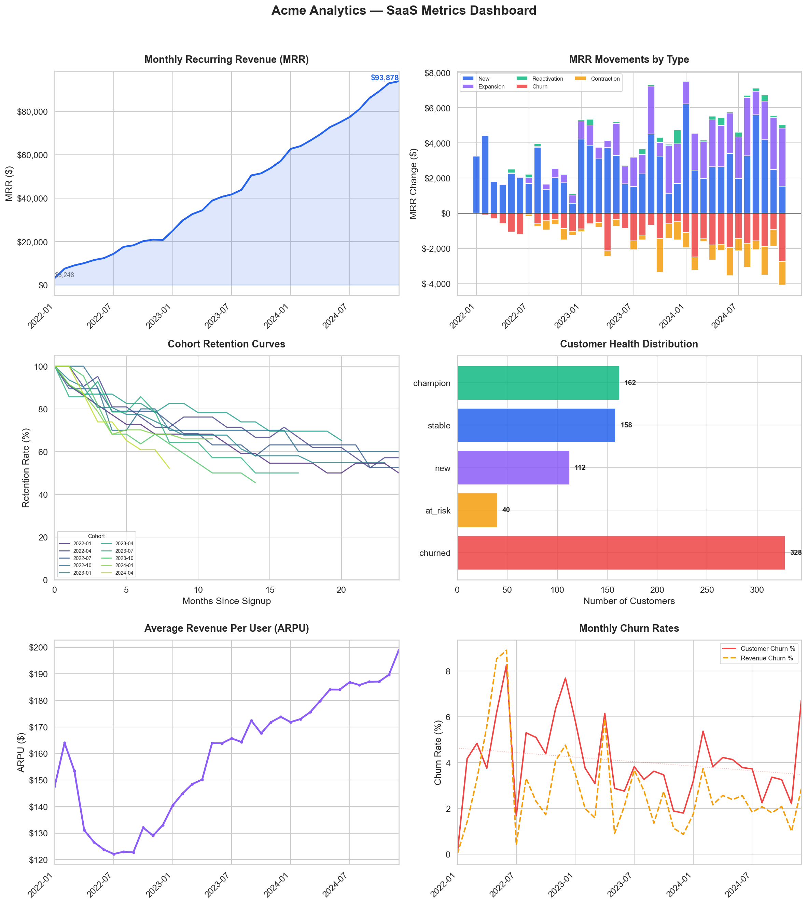

# SaaS Metrics Pipeline
### Subscription Analytics from Raw Events to MRR, Churn, Cohort Retention, and Customer LTV


## The Problem

SaaS companies live and die by recurring revenue, but the raw data (signup events, plan changes, cancellations) does not directly answer the questions that matter: Is MRR growing? Where is the growth coming from? Which customers are at risk? Are we retaining the right cohorts?

This project builds the transformation layer that turns raw subscription events into the core financial metrics every SaaS business tracks. The pipeline follows dbt-style modeling conventions (staging, intermediate, marts) and includes data quality checks, so the outputs are trustworthy enough to put in front of a finance team or a board deck.

## Dataset

**Source:** Synthetic, generated by `data/generate_data.py` with a fixed random seed for reproducibility.

I chose synthetic data intentionally so anyone can clone this repo and run the full pipeline end-to-end without API keys, downloads, or data agreements. The generator models patterns that show up in real B2B SaaS businesses:

- Signup seasonality (Q1 budget flush, Q3 ramp-up, holiday slowdown)
- Tenure-dependent churn (highest in months 2-4, stabilizes after month 8)
- Plan-tier effects (Starter customers churn 50% more, Enterprise 60% less)
- Reactivation behavior (15% of churned customers return within 1-3 months)

**Scale:** 800 customers, 853 subscriptions, 1,682 lifecycle events across 36 months (Jan 2022 to Dec 2024).

**Raw tables:**

| Table | Grain | Rows | Description |
|---|---|---|---|
| `raw_customers` | One row per customer | 800 | Company name, industry, size, signup date |
| `raw_plans` | One row per pricing tier | 4 | Starter ($29), Professional ($79), Business ($199), Enterprise ($499) |
| `raw_subscriptions` | One row per subscription period | 853 | Start/end dates, plan, MRR. Null end date means still active |
| `raw_events` | One row per lifecycle event | 1,682 | New, upgrade, downgrade, churn, reactivation with MRR before/after |

## Architecture

```
Raw CSV Data               Staging Layer              Intermediate Layer            Mart Layer
─────────────            ────────────────           ──────────────────           ──────────────
raw_customers  ─────►   stg_customers    ─────►   int_subscription_months ──►  fct_mrr_summary
raw_plans      ─────►   stg_plans        ─────►   int_mrr_movements      ──►  fct_cohort_retention
raw_subscriptions ──►   stg_subscriptions                                 ──►  dim_customer_ltv
raw_events     ─────►   stg_events
```

The pipeline runner (`run_pipeline.py`) loads CSVs into SQLite and executes each SQL model in dependency order, mimicking what `dbt run` does under the hood. I built the orchestration layer manually so I can explain every step of the DAG rather than abstracting it away behind a tool. All `.sql` files are standard SQL and can be lifted directly into a dbt project with minimal changes.

**Why SQLite?** Zero external dependencies. Anyone with Python installed can run this. The SQL is portable to Postgres, BigQuery, or Snowflake with minor dialect adjustments.

## Pipeline Overview

**1. Data generation** (`data/generate_data.py`)
Creates four raw CSV files modeling a fictional B2B SaaS company called "Acme Analytics." Customer signups follow seasonal and growth-trend distributions. Each customer is walked month-by-month through a probabilistic lifecycle: churn checks (tenure and plan-dependent), upgrade checks (more likely after month 3), downgrade checks (less common, often a churn precursor), and reactivation for a subset of churned customers.

**2. Staging models** (`models/staging/`)
Clean and standardize raw inputs. Lowercase text fields, cast dates, add computed columns like `signup_cohort`, `subscription_status`, `tenure_months`, and `mrr_delta`. Nothing fancy here, just making the raw data consistently shaped for downstream use.

**3. Intermediate models** (`models/intermediate/`)
This is where the real logic lives. `int_subscription_months` creates a monthly spine: one row per subscription per active month, carrying forward the correct MRR even in months where no event occurred. This is the foundation that makes MRR calculations possible. Without it, you are stuck trying to aggregate event-level data directly, which gets messy fast. `int_mrr_movements` classifies each event into the five standard SaaS MRR categories (new, expansion, contraction, churn, reactivation).

**4. Mart models** (`models/marts/`)
Business-facing output tables. `fct_mrr_summary` is the monthly MRR waterfall with churn rates and ARPU. `fct_cohort_retention` tracks what percentage of each signup cohort remains active over time. `dim_customer_ltv` is a single row per customer with lifetime revenue, behavioral signals, a health score, and an LTV estimate.

**5. Data quality checks** (built into `run_pipeline.py`)
Five assertions run after every pipeline execution. Details below.

**6. Analysis and visualization** (`analysis/analyze.py`)
Reads from the mart tables and produces a 6-panel dashboard covering the metrics that come up in every SaaS board meeting.

## Dashboard



## Key Metrics

| Metric | Definition | Why It Matters |
|---|---|---|
| MRR | Sum of all active subscription revenue in a given month | The headline SaaS financial metric |
| Net MRR Change | New + Expansion + Reactivation - Churn - Contraction | Shows whether the business is growing or shrinking |
| Gross Customer Churn Rate | Churned customers / start-of-month active customers | Measures product-market fit |
| Gross Revenue Churn Rate | Lost MRR / start-of-month MRR | Revenue-weighted view of retention |
| ARPU | Total MRR / Active Customers | Pricing power and mix shift indicator |
| Cohort Retention | % of a signup cohort still active N months later | The best measure of long-term product health |
| Customer LTV | Historical revenue + projected future revenue | Customer-level profitability estimate |

## Results Summary

| Metric | Value |
|---|---|
| Starting MRR (Jan 2022) | $3,248 |
| Ending MRR (Dec 2024) | $93,878 |
| MRR Growth (total period) | 2,790% |
| Active Customers (Dec 2024) | 472 |
| ARPU (Dec 2024) | $198.89 |
| Avg Monthly Customer Churn | 4.05% |
| Avg LTV (active customers) | $3,893 |

MRR grew from $3.2K to $93.9K over 36 months, driven primarily by new customer acquisition with steady expansion revenue from upgrades. ARPU increased from roughly $148 to $199, indicating successful upselling into higher-tier plans over time. Cohort retention curves flatten around 55-70% after month 10, suggesting strong long-term retention once customers survive the initial adoption window. The average monthly churn rate of 4.05% shows a visible downward trend in later months as the customer base matures.

## Data Quality Checks

| Check | What It Validates | Result |
|---|---|---|
| No negative MRR | Subscription months never have negative revenue | PASS |
| All customers in LTV | Every customer appears in the final dimension table | PASS |
| Retention <= 100% | Cohort retention rates are mathematically valid | PASS |
| Full month coverage | MRR summary spans all 36 analysis months | PASS (36) |
| No orphaned events | Every event references a valid subscription | PASS |

## Known Limitations

- **LTV projection is simplistic.** The 6-month forward projection uses flat average MRR rather than a survival-curve-weighted estimate. A production model would use Kaplan-Meier or a probabilistic approach like BG/NBD.
- **MRR carry-forward uses a correlated subquery.** The `int_subscription_months` model handles months with no events via a correlated subquery that would not scale well beyond roughly 100K rows. In a warehouse context, this would use `LAST_VALUE` with `IGNORE NULLS`.
- **No incremental loading.** The pipeline does a full rebuild on every run. A production pipeline would use incremental materialization for the subscription spine.
- **Customer churn rate denominator is approximate.** It uses active customers at end of month plus churned, rather than a true beginning-of-month count derived from the prior month.
- **Synthetic data, not real-world messy data.** The generator produces clean, well-typed CSVs. A real subscription dataset would have nulls, timezone inconsistencies, duplicate events, and retroactive corrections that the staging layer would need to handle.

## Project Structure

```
saas_metrics_pipeline/
├── README.md
├── requirements.txt
├── run_pipeline.py                # Pipeline orchestrator
├── data/
│   ├── generate_data.py           # Synthetic data generator
│   ├── raw_customers.csv
│   ├── raw_plans.csv
│   ├── raw_subscriptions.csv
│   └── raw_events.csv
├── models/
│   ├── staging/
│   │   ├── stg_customers.sql
│   │   ├── stg_plans.sql
│   │   ├── stg_subscriptions.sql
│   │   └── stg_events.sql
│   ├── intermediate/
│   │   ├── int_subscription_months.sql
│   │   └── int_mrr_movements.sql
│   └── marts/
│       ├── fct_mrr_summary.sql
│       ├── fct_cohort_retention.sql
│       └── dim_customer_ltv.sql
├── analysis/
│   └── analyze.py                 # Visualization and analytical summary
└── output/
    ├── fct_mrr_summary.csv
    ├── fct_cohort_retention.csv
    ├── dim_customer_ltv.csv
    └── saas_metrics_dashboard.png
```

## Reproducing This Project

```bash
git clone https://github.com/Kablan-ASBN/saas_metrics_pipeline.git
cd saas_metrics_pipeline
pip install -r requirements.txt

python data/generate_data.py       # Generate raw CSVs
python run_pipeline.py             # Run staging, intermediate, marts + quality checks
python analysis/analyze.py         # Generate dashboard
```

No external data downloads, API keys, or database setup required. Everything runs locally with Python and SQLite.

## Takeaway

The raw event log of a SaaS business does not answer financial questions directly. The value is in the transformation layer: building a monthly subscription spine, classifying MRR movements into standard categories, and producing outputs that a finance team can query without second-guessing the numbers. This project demonstrates that layer end-to-end, from data generation through validated mart tables to analytical outputs.

*Part of a portfolio focused on analytics engineering, data quality, and production-grade reporting systems.*

*Author: [Kablan Assebian](https://www.linkedin.com/in/gomis-kablan/) · [GitHub](https://github.com/Kablan-ASBN)*